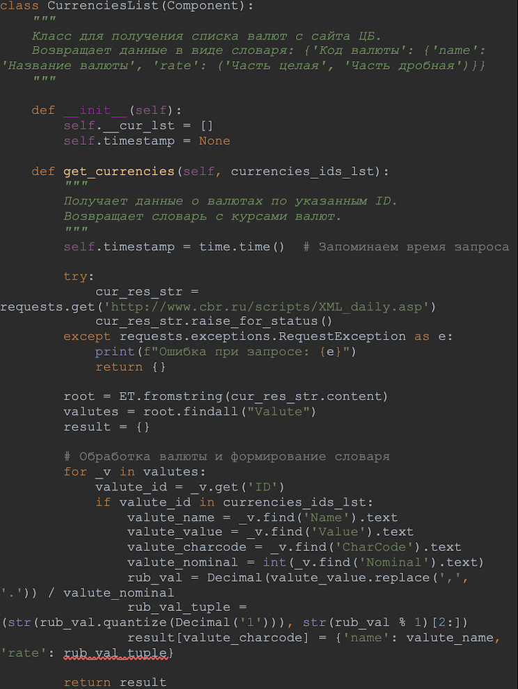
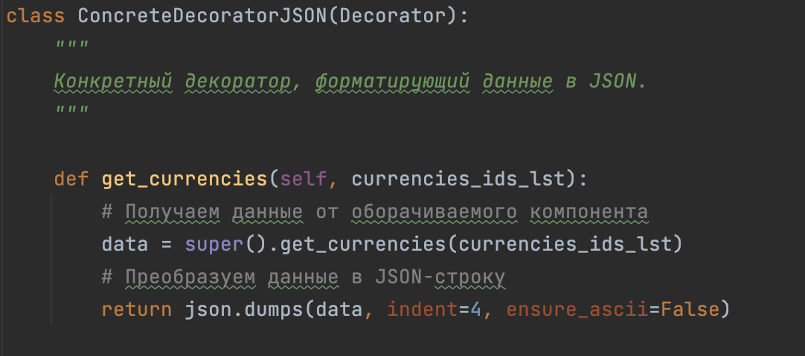
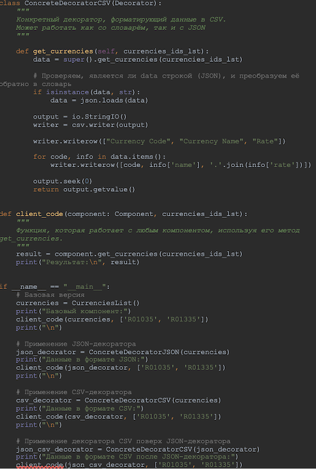

# Лабораторная работа 6. Использование шаблона «Декоратор»
## Костылева ЭП ИВТ 3 курс

#### Фрагмент кода для использования базовой версию для получения информации о валютах, который возвращает словарь со структурой (class CurrenciesList):

#### Фрагмент кода для применения декоратора к базовой версии и получения данных в формате JSON (class ConcreteDecoratorJSON)

#### Фрагмент кода для использования декоратора к базовой версии (CurrenciesList) или к другому декоратору (ConcreteDecoratorJSON) и получение данных в формате csv (class ConcreteDecoratorCSV):

