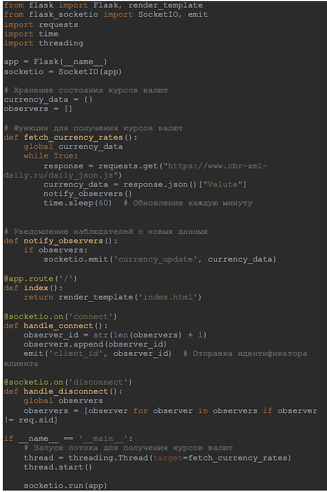
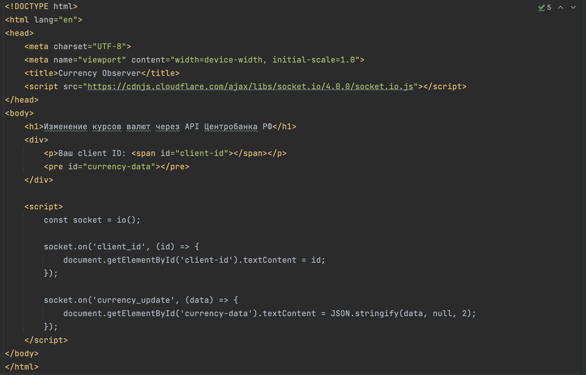
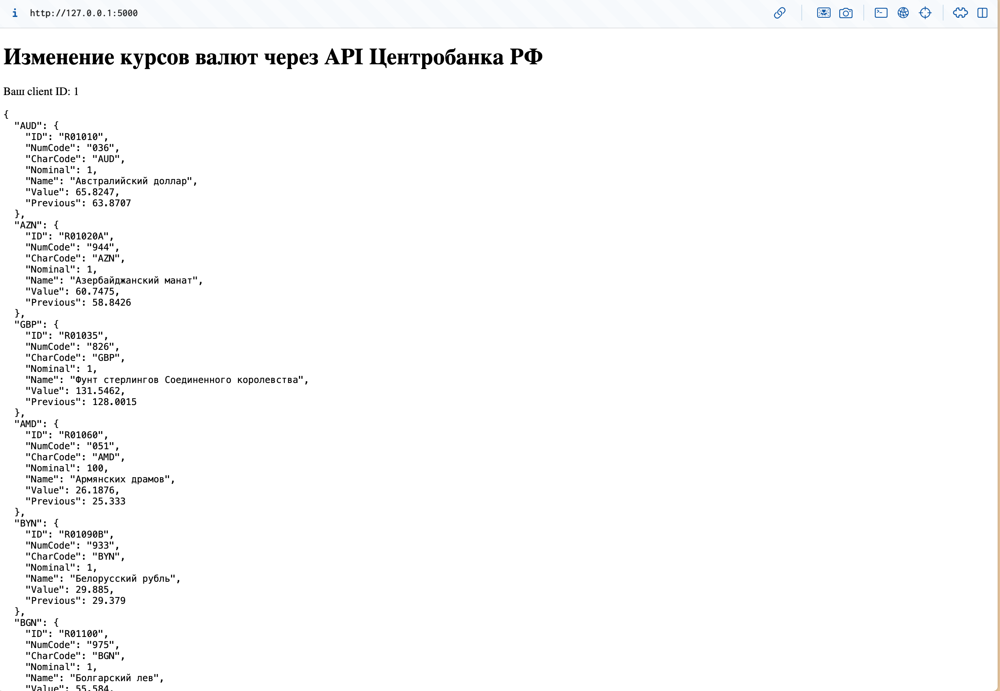

# Лабораторная работа №7. Использование шаблона «Наблюдатель»
### Костылева Э.П. ИВТ 3 курс гр 1.1

#### Фрагмент кода для создания веб-сервера на Flask - файл app.py:

#### html-файл, через который реализованы наблюдатели-клиенты:

#### Для работы кода в терминале введем python3 app.py. Ожидаем около 1 минуты для загрузки данных. Результат:

