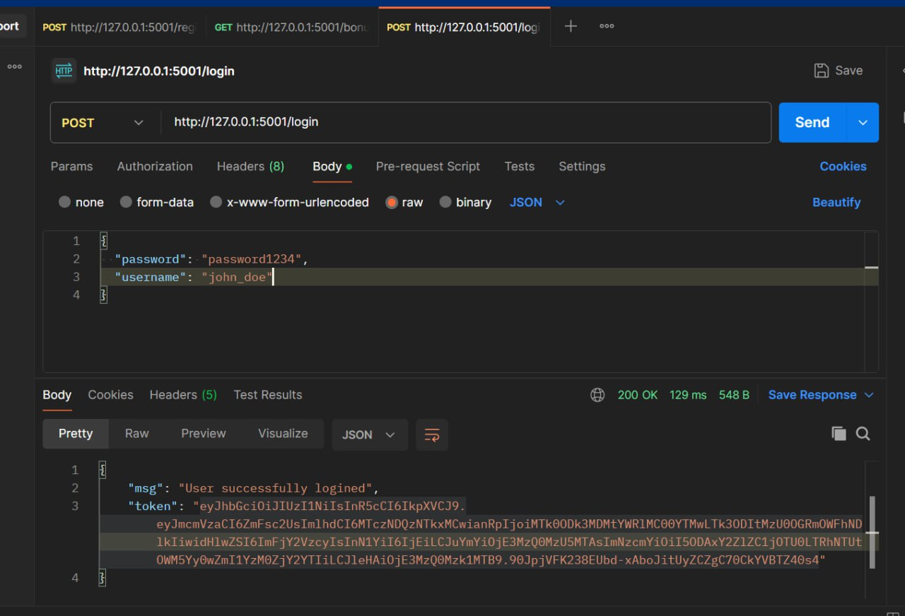

# Лабораторная работа 9. 
### выполнила Костылева Э.П. ИВТ 3 курс гр.1.1

## Описание


Реализуйте REST-сервис для просмотра текущего уровня бонусной программы, который дает определенный кешбэк пользователю и следующего уровня ("серебряный", "золотой", "платиновый" уровень при определенном объеме трат). Поскольку эти данные являются важными и критичными, каждый пользователь может видеть только информацию о своем кэшбеке. Для обеспечения безопасности потребуется реализовать метод, который по логину и паролю сотрудника будет выдавать секретный токен, действующий в течение определенного времени. Запрос данных о бонусной программе должен выдаваться только при предъявлении валидного токена пользователем. В модели данных и в интерфейсе соответственно должны быть отображены. Уровень трат и границы бонусных уровней
## Ход установки:

### 1. Клонировать репозиторий

```bash
git clone …
```

### 2. Открыть корневую папку
```bash
cd app
```

### 3. Собрать контейнер и запустить
```bash
docker-compose up --build -d
```
## Документация к получившемуся API
### Перейдите по ссылке:
```bash
http://127.0.0.1:5001/apidocs
```
## Примеры запросов:
### Aутентификация сотрудника через метод POST


### Получение информации о текущем уровне бонусной программы и кешбэке для пользователя с указанным ID через метод GET


### Добавление новой транзакции для пользователя, что будет инициировать обновление уровня бонусов через метод POST 


